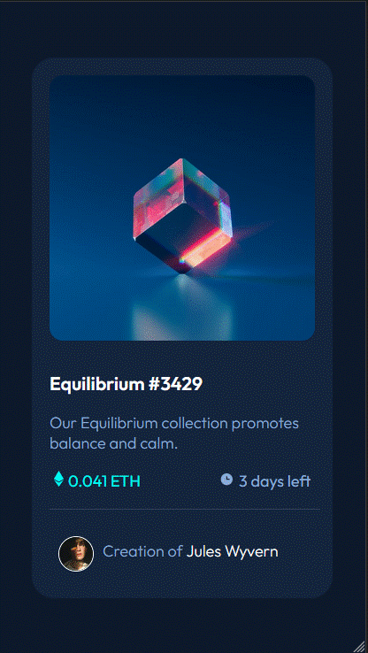
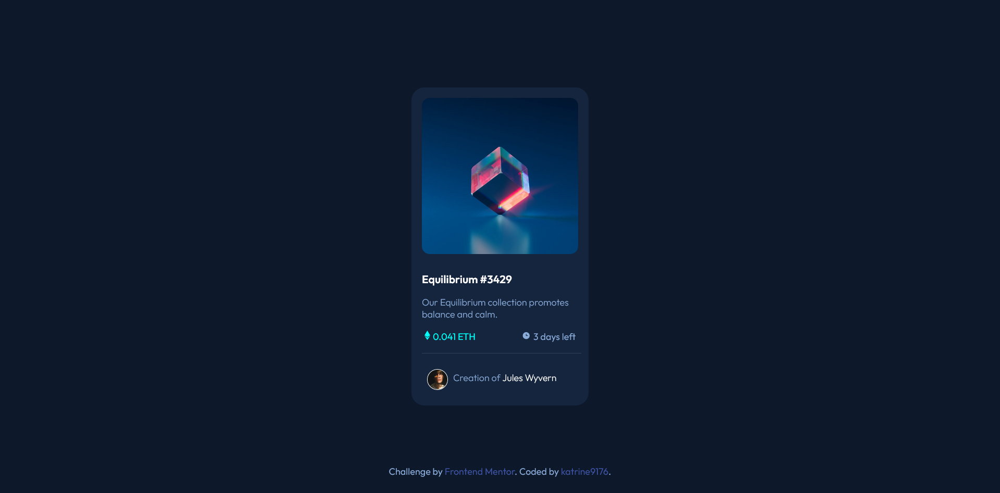

# Frontend Mentor - NFT preview card component solution

This is a solution to the [NFT preview card component challenge on Frontend Mentor](https://www.frontendmentor.io/challenges/nft-preview-card-component-SbdUL_w0U). Frontend Mentor challenges help you improve your coding skills by building realistic projects. 

## Table of contents

- [Overview](#overview)
  - [The challenge](#the-challenge)
  - [Screenshot](#screenshot)
  - [Links](#links)
- [My process](#my-process)
  - [Built with](#built-with)
- [Author](#author)

## Overview

### The challenge

Users should be able to:

- View the optimal layout depending on their device's screen size
- See hover states for interactive elements

### Screenshot

### Links

- Solution URL: [Solution URL](https://github.com/katrine9176/nft-preview-card-Frontendmentor)
- Live Site URL: [Live site URL](https://katrine9176.github.io/nft-preview-card-Frontendmentor/)

## My process

1. Make basic HTML structure.
2. Build mobile and desktop version.
3. Added active states.

### Built with

- SASS,
- Flexbox.

## Author

- Frontend Mentor - [@katrine9176](https://www.frontendmentor.io/profile/katrine9176)

